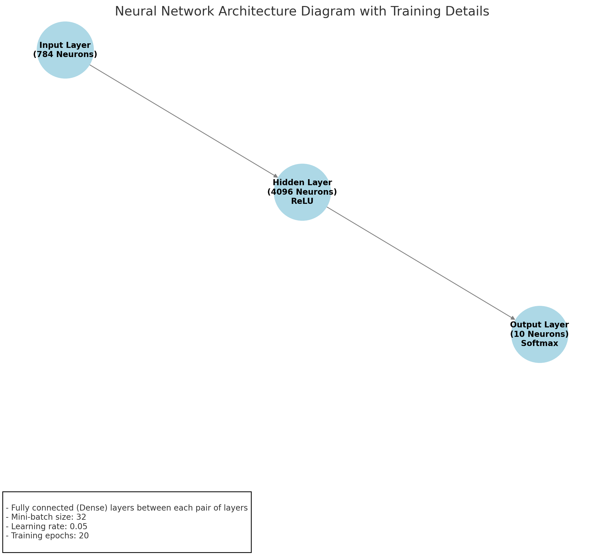

## mlp.cu

The `mlp.cu` file contains the implementation of a multilayer perceptron (MLP) model using CUDA for GPU acceleration. This implementation aims to leverage the parallel processing capabilities of GPUs to speed up the training and inference of the neural network.

### Key Components

1. **Neural Network Structure**:
    - The neural network consists of three layers: an input layer, a hidden layer, and an output layer.
    - The `NeuralNetwork` struct holds the weights, biases, and gradients for the network.
    - Below is a visual representation of the neural network structure:

    

2. **CUDA Kernels**:
    - Several CUDA kernels are defined for matrix multiplication, ReLU activation, bias addition, softmax, gradient computation, and weight updates.
    - These kernels are used to perform the forward and backward passes of the neural network efficiently on the GPU.

3. **Initialization Functions**:
    - Functions for initializing weights and biases using Kaiming initialization and setting biases to zero.

4. **Data Loading Functions**:
    - Functions to load training and test data from binary files into GPU memory.

5. **Forward Pass**:
    - The `forward` function performs the forward pass of the neural network using CUDA kernels for matrix multiplication, bias addition, ReLU activation, and softmax.

6. **Backward Pass**:
    - The `backward` function computes the gradients of the loss with respect to the weights and biases using CUDA kernels.

7. **Weight Update**:
    - The `update_weights` function updates the weights and biases using gradient descent.

8. **Training and Evaluation**:
    - The `train` function trains the neural network on the training data for a specified number of epochs.
    - The `evaluate_accuracy` function evaluates the accuracy of the neural network on the test data.

### CUDA Installation

To run the `mlp.cu` file, you need to have CUDA and cuBLAS installed on your system. Follow these steps to install CUDA:

1. **Download the CUDA Toolkit**:
    - Go to the [CUDA Toolkit Download](https://developer.nvidia.com/cuda-downloads) page.
    - Select your operating system, architecture, distribution, and version.
    - Download the installer for your system.

2. **Install the CUDA Toolkit**:
    - Follow the installation instructions provided on the download page for your specific operating system.

3. **Set Up Environment Variables**:
    - Add the CUDA paths to your environment variables. You can add the following lines to your `~/.bashrc` or `~/.zshrc` file:
    ```sh
    export PATH=/usr/local/cuda/bin:$PATH
    export LD_LIBRARY_PATH=/usr/local/cuda/lib64:$LD_LIBRARY_PATH
    ```

4. **Verify the Installation**:
    - To verify that CUDA is installed correctly, you can run the following command:
    ```sh
    nvcc --version
    ```

    - You should see the CUDA version information printed to the console.

Once CUDA and cuBLAS are installed, you can proceed to compile and run the `mlp.cu` file as described in the "Running" section.


### Running

To run the `mlp.cu` file, follow these steps:

1. **Compile the CUDA source file**:
    - Use the `nvcc` compiler to compile the `mlp.cu` file. If you are using cuBLAS, make sure to link against the cuBLAS library.
    ```sh
    nvcc -o mlp_cublas mlp.cu -lcublas
    ```

2. **Prepare the MNIST dataset**:
    - Ensure that the MNIST dataset is downloaded and saved in the appropriate binary format. You can use the provided [downloader.py](http://_vscodecontentref_/1) script to download and save the dataset. Make sure to download necessary `python` modules first using `pip install -r requirements.txt`.
    ```sh
    python downloader.py
    ```

3. **Run the compiled executable**:
    - Execute the compiled binary to train and evaluate the neural network.
    ```sh
    ./mlp_cublas
    ```

This will train the neural network on the MNIST dataset and evaluate its accuracy on the test data. The training and evaluation results will be printed to the console.